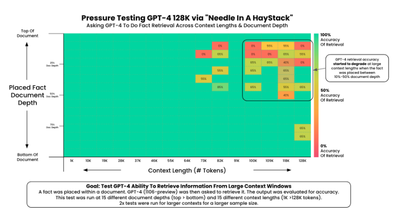
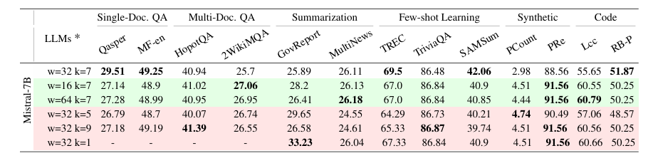

### 20251202_窗口/容量实验

模型统一为mistral-7B-instruct-v0.2
模型基础显存消耗：14332MB


| 窗口大小 | 最大缓存容量 | 显存消耗  | 推理速度(s) | 正确率     |
|------|--------|-------|---------|---------|
| 16   | 4096   | 20430 | 331     | 66/400  |
| 32   | 4096   | 20430 | 336     | 110/494 |
| 64   | 4096   | 20430 | 331     | 236/400 |
| 32   | 2048   | 18485 | 311     | 278/600 |
| 32   | 1024   | 17973 | 297     | value5  |
| 32   | 512    | 17717 | 285     | value5  |
| 不压缩  | 不压缩   | 20685 | 346     | value5  |
| 无KV  | 无KV   | OOM   | N/A     | value5  |

- 对照组是32-4096：snapkv默认配置，这个效果应该对标论文效果
- 因为是问答型数据集，输出正确性要人工判断，还没一个一个看，可能之后写个用LLM判断的脚本或者简单直接看了？
  - 用GPT简单看了一下窗口大小的正确率（因为这个理论上最影响正确率），窗口越大正确率应该是越高的（肯定不完全准，只能看一下趋势）
- 窗口大小几乎不影响显存消耗和推理速度
  - 从原理看窗口大小确实应该不影响显存消耗，但推理速度也几乎没有区别，应该是计算负载很低，所以没必要从窗口大小里抠算力，直接设一个不影响性能的窗口大小就行
  - 目前没发现窗口大小会影响性能，但如果窗口大小太大了性能会降低，可以想办法让他自己找到最大的窗口大小？
  - 从原理上将窗口大小会影响推理精准度，窗口大小实验的精准度要关注一下，如果本身精准度就很高的话就没必要去自动找窗口大小了
- 最大缓存容量会影响显存消耗，但是影响没有那么明显
  - 应该和模型小有关系，从优化量来说4096→2048就从6G变成4G了，减少了30%的显存
  - 精准度降了大概15%（接近60%→45%，虽然是GPT统计的但是应该有参考价值），这种程度的可以尝试使用补偿token


### 20251210
----------------------------------------

跑一下：
w32b32 
w32b64
w32b128
w32b256
```bash
nohup python pred_snap.py --model mistral-7B-instruct-v0.2 --compress_args_path ablation_c4096_w32_b32_k7_maxpool.json > 20251210c4096w32b32.log 2>&1 &
nohup python pred_snap.py --model mistral-7B-instruct-v0.2 --compress_args_path ablation_c4096_w32_b64_k7_maxpool.json > 20251210c4096w32b64.log 2>&1 &
nohup python pred_snap.py --model mistral-7B-instruct-v0.2 --compress_args_path ablation_c4096_w32_b128_k7_maxpool.json > 20251210c4096w32b128.log 2>&1 &
nohup python pred_snap.py --model mistral-7B-instruct-v0.2 --compress_args_path ablation_c4096_w32_b256_k7_maxpool.json > 20251210c4096w32b256.log 2>&1 &
```

w64b32
w64b128
w64b512
w64c2048b64
```bash
nohup python pred_snap.py --model mistral-7B-instruct-v0.2 --compress_args_path ablation_c4096_w64_b32_k7_maxpool.json > 20251210c4096w64b32.log 2>&1 &
nohup python pred_snap.py --model mistral-7B-instruct-v0.2 --compress_args_path ablation_c4096_w64_b128_k7_maxpool.json > 20251210c4096w64b128.log 2>&1 &
nohup python pred_snap.py --model mistral-7B-instruct-v0.2 --compress_args_path ablation_c4096_w64_b512_k7_maxpool.json > 20251210c4096w64b512.log 2>&1 &
nohup python pred_snap.py --model mistral-7B-instruct-v0.2 --compress_args_path ablation_c2048_w64_b64_k7_maxpool.json > 20251210c2048w64b64.log 2>&1 &
```


w64b64 141/200=70.5%
w64   196/400=49%

**照理说c4096b4096和原先只生成一个补偿token的方案是等效的，但是原方案要不也实验一下做个对照？**
```bash
nohup python pred_snap.py --model mistral-7B-instruct-v0.2 --compress_args_path ablation_c4096_w64_fullc_k7_maxpool.json > 20251210c4096w64fullc.log 2>&1 &
```

| 窗口大小 | 最大缓存容量 | 补偿块大小 | 显存消耗  | 推理速度(s) | 正确率                |
|------|--------|-------|-------|---------|--------------------|
| 16   | 4096   | 无补偿   | 20430 | 331     | 66/400 = 16.5% *   |
| 32   | 4096   | 无补偿   | 20430 | 336     | 110/494 = 22.3% *  |
| 32   | 2048   | 无补偿   | 18485 | 311     | 278/600 = 46.3%    |
| 64   | 4096   | 无补偿   | 20430 | 331     | 131/200 =65.5% *   |
| 32   | 4096   | 32    | 20430 | -       | 109/200 = 54.5%    |
| 32   | 4096   | 64    | 20430 | -       | 120/200 = 60%      |
| 32   | 4096   | 128   | 20430 | -       | 124/200 = 62%      |
| 32   | 4096   | 256   | 20430 | -       | -                  |
| 64   | 2048   | 32    | -     | -       | -                  |
| 64   | 4096   | 32    | 20430 | -       | 112/200 = 56.0%    |
| 64   | 4096   | fullc | 20430 | 334     | 112/200 = 56.0%    |
| 64   | 4096   | 64    | 20430 | 356     | 127/200=63.5%      |
| 64   | 4096   | 128   | 20430 | -       | 118 / 200 = 59.0%  |
| 64   | 4096   | 256   | 20430 | 341     | 121/200 = 60.5%    |
| 64   | 4096   | 512   | 20430 | -       | 106/199 = 53.27% * |
| 64   | 4096   | 1024  | 20430 | 336     | 127/200 = 63.5%    |
| 64   | 4096   | 4096  | 20430 | 335     | 126/200 = 63%      |
| 64   | 1024   | 64    | -     | 312     | 118/200 = 59%      |


加了补偿块之后显存消耗几乎不变，计算时间稍微变长（7.5%）


- 窗口大小（在现在的尺度下）和缓存容量对精准度的影响都是单调的：窗口↑、缓存容量↑ = 精准度↑
- 缓存块的大小对精准度的影响感觉是有个极值的，太大太小精准度都会变低，极值位置也受窗口大小影响： 看了w64的结果之后补做了w64更多细分、w32以及原先补偿方案
  - 缓存块的大小可以尝试找到最优点，正好可以补充实验丰富度 → 可以提前预计算；如果要做实时的自适应，那就需要一个实时评估当前模型面对当前上下文性能的方案，这个不知道咋整 
  - 缓存块大小调好了是比原补偿方案好的
  - 但：加了补偿后的精准度目前都低于无补偿，但最小差距只有2% → 可能是GPT判断正误的误差

但是正确率GPT评估太不稳定了，每次实验结果拿给他判断好几次每次都有浮动
- 更新：统一了一下，从回答里截取前200条然后统一prompt，判断结果基本就稳定了
- 查一下其他论文的评估指标是怎么得到的（有统一评估脚本？换能直接量化acc的数据集？）

### 20251216
- 先解决正确率问题：看其他文章正确率是怎么评估的（可以看代码有没有评估部分）
  - 参考其他KV缓存工作里的指标，确定要评估的指标和对比方案

论文中的评估指标：

### 模型性能指标：
Needle-in-a-Haystack: 
- 长上下文寻回挑战（阅读理解），用于测试模型处理长上下文的能力，正好用于KV缓存压缩场景下记忆丢失的问题
- 基本所有KV缓存压缩文章都用了这个（razorattention（甚至只用了这个就足够展示性能）、snapkv、pyramidkv这些都用了）
- 评估也是需要模型进行评估，但是有个开源仓库，里面有写好的评估代码，还提供了可视化，这个可视化在很多KV缓存论文里都看到过，所以标准是统一的



LongBench：
- 长上下文阅读理解数据集，内部还有多个任务类型（QA、总结...），适合评估模型处理长上下文的能力
- 这个也是基本所有的文章都用的
- 查了一下，longbench也有一个自己的仓库，然后仓库里面提供了个评估脚本（不是模型，是综合了F1分数、正则之类的指标然后定了一个性能分数的计算方式）
- 用他的脚本算出来的性能分数是统一的，应该以这个分数为准，分数差不多长这样：



--------------------------

前面两个是最常见的（应该是KV缓存领域认可度很高的），不少论文甚至只需要用其中一个就足够证明
后面还有一些论文用了比较通用的评估LLM性能的数据集，但是有这些问题：
- 这种数据集比较多比较杂，要找到用了同一数据集的可能很少：对比基线少
- 用的论文一般都比较老（H2O这种）可能认可度没有前面两个高，能用前面两个数据集就用

OpenBookQA、PiQA、COPA这些，也是开源数据集
一般要这几个一起展示，应该是为了平行对比不同任务性能，只需要展示一个得分，应该也是数据集内部给了评估脚本或者直接用的正确率
- 比较新的文章（比如snapkv）不一定用了，然后不同的文章喜欢从里面挑几个，横向对比很麻烦
- 要跑好几个数据集，kv缓存相关的代码不太好直接--model把模型传进去就跑，要把数据集测试代码写到这边的采样代码里，所以每个数据集要单独写，太麻烦收益又太低，不用这些


### 解码速度和显存消耗量指标
这个就比较直观，一般展示下面的数据：
解码速度：Decoding latency
显存消耗：取最大值就行


对比方案：
- 一定有的是自己和fullkv的对比，主要对比上面数据集的得分证明方案性能（有些文章就只有这个也够，像CaM）
  - 然后一般要做自己方案里不同超参数和不同功能开关的消融实验，就可以一个方案多列几行（snapkv在内的几乎所有文章都这么干）
- 然后一般还会对比一个其他方案（感觉就是这个文章方案的主要参考方案，比如snapkv对比的就是H2O，RKV对比的就是snapkv）
  - 这个我们直接对比snapkv即可


- 低缓存容量补偿效果可能较好，可以考虑看探索或者作为主要贡献：尝试找到边界
  - 探索补偿后不降低正确率的界限：缓存块大小 - 正确率降不降低
  - 探索补偿后效果更好的缓存容量
- 补偿后正确率反而降低的原因需要找到 


```bash
python eval_auto.py --model all
```

| 窗口大小 | 最大缓存容量 | 补偿块大小 | 显存消耗  | 推理速度(s) | LongBench得分 |
|------|--------|-------|-------|---------|------------|
| 16   | 4096   | 无补偿   | 20430 | 331     | 33.56      |
| 32   | 4096   | 无补偿   | 20430 | 336     | 33.71      |
| 32   | 2048   | 无补偿   | 18485 | 311     | 32.44      |
| 64   | 4096   | 无补偿   | 20430 | 331     | 33.05      |
| 32   | 1024   | 无补偿    | -     | 312     | 29.57      |
| 32   | 512    | 无补偿    | -     | 312     | 28.78      |


| 窗口大小 | 最大缓存容量 | 补偿块大小 | 显存消耗  | 推理速度(s) | LongBench得分 |
|------|--------|-------|-------|---------|------------|
| 16   | 4096   | 64    | 20430 | -       | 32.47      |
| 32   | 4096   | 32    | 20430 | -       | 32.53      |
| 32   | 4096   | 64    | 20430 | -       | 32.11      |
| 32   | 4096   | 128   | 20430 | -       | 32.48      |
| 32   | 4096   | 256   | 20430 | -       | 33.11      |
| 64   | 2048   | 64    | -     | -       | 31.71      |
| 64   | 4096   | 32    | 20430 | -       | 32.32      |
| 64   | 4096   | fullc | 20430 | 334     | 32.96      |
| 64   | 4096   | 64    | 20430 | 356     | 31.72      |
| 64   | 4096   | 128   | 20430 | -       | 32.58      |
| 64   | 4096   | 256   | 20430 | 341     | 32.71      |
| 64   | 4096   | 512   | 20430 | -       | 32.99      |
| 64   | 4096   | 1024  | 20430 | 336     | 32.94      |
| 64   | 4096   | 4096  | 20430 | 335     | 32.95      |
| 64   | 1024   | 64    | -     | 312     | 29.97      |